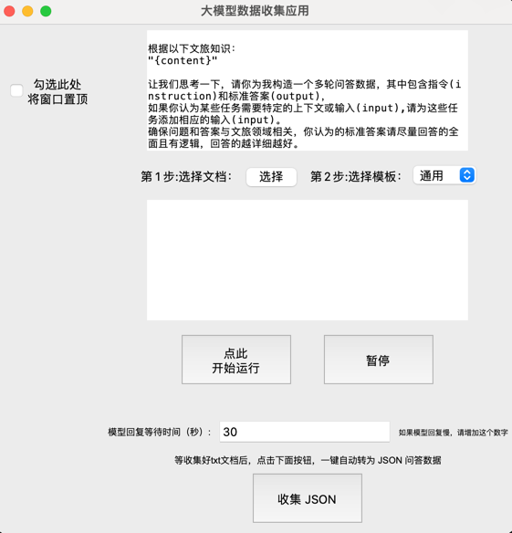
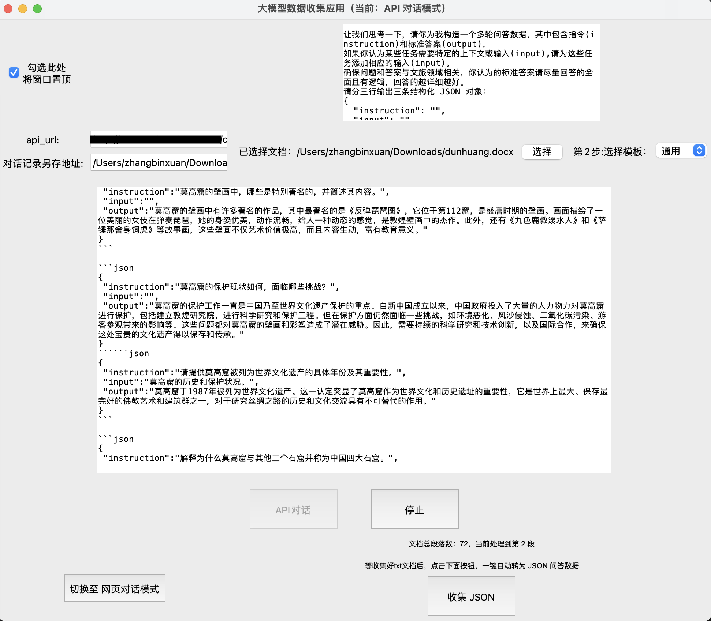

# LLM-data-maker
在大模型网页端自动提问的应用,用来收集微调大模型的问答数据。The application of automatic questioning on the large model web page is used to collect question answering data for fine-tuning the large model.

## 1. 项目背景
在大模型微调的过程中，我们需要大量的json问答数据，但是人工标注数据的成本很高。为了降低标注数据的成本，我们可以利用大模型自动生成问题和对应的回答，从而得到微调大模型所需要的json问答数据。这个项目就是为了实现这个目的。
 
一般有通过api方式和网页端方式来实现自动提问。api方式需要调用api接口，而网页端方式可以直接在网页上实现自动提问。这个项目就是通过网页端自动提问的方式来实现问答数据的收集。
 

## 2. 项目功能预览
 

- 首先需要收集好特定领域的文本数据
- 手动清理数据，去除无用数据，保存为word格式 (word文档中的文本数据需要分为一段一段，从而自动依次提取每一段来输入到网页端)
- 运行应用后，上传word文档
- 选择对应模版，点击开始运行
- 手动在网页端保存大模型返回的json问答数据
- 重复以上步骤，直到收集到足够的问答数据

 

- 新增API对话模式，可以通过API方式自动提问和保存问答数据


## 3. 项目部署
### 直接下载应用 
```
点击[阿里网盘]()下载应用
```
### 本地部署
```bash
git clone https://github.com/binxuan98/LLM-data-maker.git
cd LLM-data-maker
pip install -r requirements.txt -i https://pypi.tuna.tsinghua.edu.cn/simple
python app.py
```

## 4. 未来规划
- 增加api方式自动提问的功能
- 优化大模型返回的问答数据的保存方式
- 增加数据清洗的功能


 

### 项目致谢
- 感谢兰州大学提供的GPU支持
- https://github.com/SupritYoung/free-self-instruct


### 项目许可
- 本项目遵循Apache-2.0开源协议
- 本项目仅用于学习和研究目的


